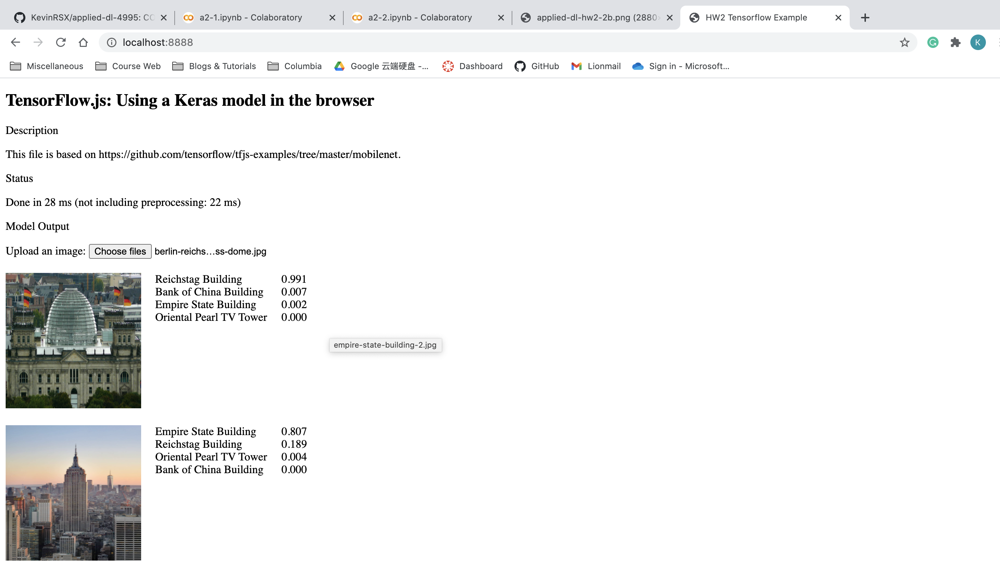

# landmark-classifier-js

A Tensorflow.js demo based on [Tensorflow.js MobileNet demo](https://github.com/tensorflow/tfjs-examples/tree/master/mobilenet)


A simple ConvNet model trained in Tensorflow and [converted](https://www.tensorflow.org/js/guide/conversion) to tfjs, which classifies four buildings:
 - Oriental Pearl TV Tower, Shanghai, China
 - Bank of China Building, Hong Kong S.A.R.
 - Empire State Building, New York, NY
 - Reichstag Building, Berlin, Germany

Train/val dataset is very small and validation accuracy is around 70%.
  
## Usage
Clone and serve this directory with any web server, e.g.,
```
python3 -m http.server port
```

Open in browser `localhost:port`. Upload a photo of any one of the buildings above and you should be able to see the predictions.
